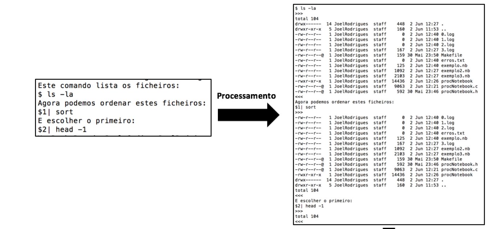
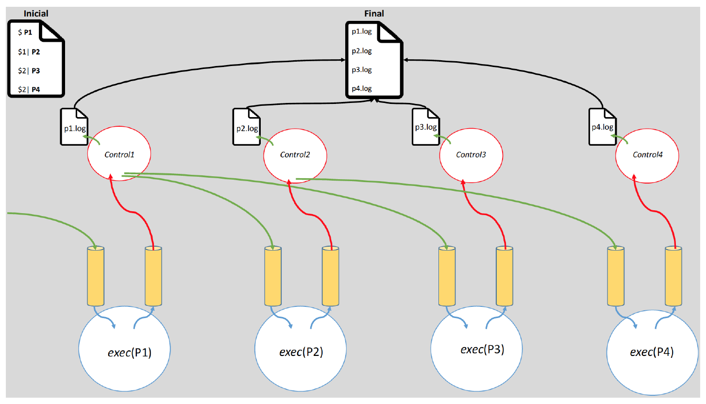

# Notebook Processing 

Este projeto concretiza um sistema para processamento de notebooks, que misturam fragmentos de código, resultados da execução, e documentação. Neste contexto, um notebook é um ficheiro de texto que depois de processado é modificado de modo a incorporar resultados da execução de código ou comandos nele embebidos. O projeto foi desenvolvido num ambiente de linguagem de programação C, recorrendo a diversas System Calls indispensáveis para um sistema totalmente paralelo. 

Em modo exemplificativo, a seguir apresenta-se um notebook antes e depois de processado: 



*Onde, o comando 1 e 2 dependem apenas do output do comando 0*

## Funcionalidades básicas do sistema

- Execução de programas 
- Re-processamento de um notebook (depois de processado e alterado é possível re-processar o notebook, obtendo os novos resultados de execução)
- Detecção de erros e interrupção da execução
- Acesso a resultados de comandos anteriores arbitrários

## Estrutura do sistema


-  *Pipes*
-  *Controladores de fluxo*
-  *Redirecionamento de outputs*
-  *Logs intermédios e escrita no notebook final*
-  *Execuções de comandos*


## Como executar
```
make clean
make 
./notebook exemplo.nb
```

## Autores
* [Joel Rodrigues](https://github.com/JoelRodrigues58)
* [Raphael Oliveira](https://github.com/raphael28)
* [Francisco Araújo](https://github.com/franciscoaraujo51)
